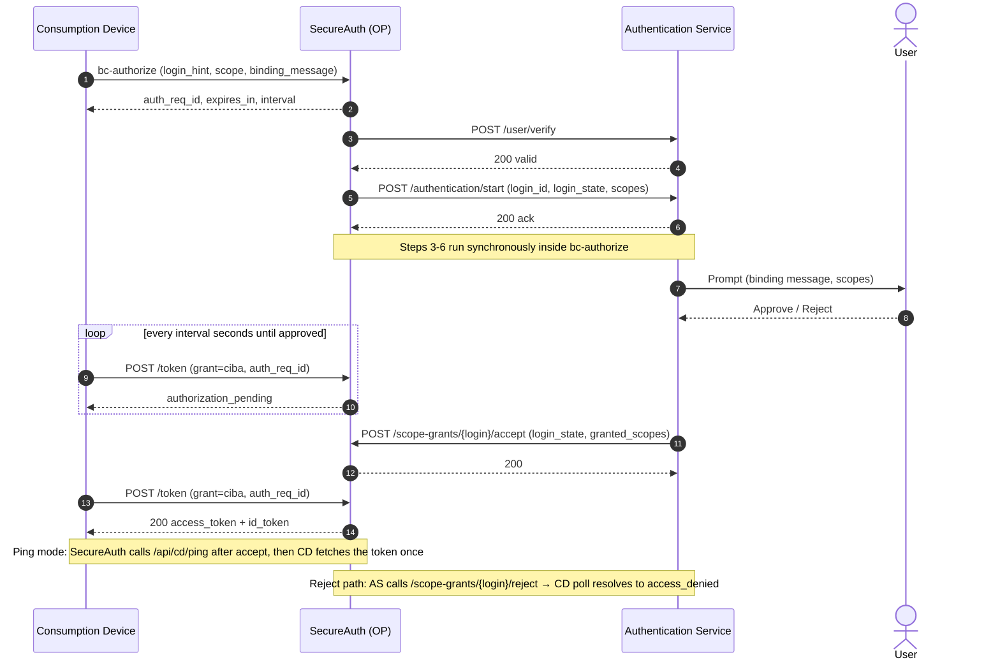

# sample-ciba

An end-to-end sample of the SecureAuth/Cloudentity **Client-Initiated Backchannel
Authentication (CIBA)** flow, built with Node.js + TypeScript. It runs both sides
of the decoupled flow against a real tenant:

- a **consumption device** (the client) that initiates backchannel auth and obtains the token, and
- a **simulated authentication service** that SecureAuth notifies, prompts the user (approve/reject), and reports the decision back.

A minimal two-panel web UI visualizes each stage live over SSE.

## The flow

1. **Consumption device** calls the backchannel endpoint (`bc-authorize`) with a
   `login_hint`; gets back `auth_req_id`, `interval`, `expires_in`.
2. **SecureAuth notifies the authentication service** — it POSTs the request to
   our `startAuthentication` webhook.
3. The **authentication service** prompts the user (binding message + scopes).
4. The **user** approves or denies.
5. The authentication service reports the decision via the SecureAuth **System
   API** (`logins`): `acceptScopeGrantRequest` / `rejectScopeGrantRequest`.
6. Meanwhile the **consumption device** polls the token endpoint
   (`grant_type=urn:openid:params:grant-type:ciba`) until success/denied/expiry.
   In **ping** mode, SecureAuth instead calls the client notification endpoint and
   the device fetches the token once.

> There is no "list pending requests" — SecureAuth *pushes* the request to the
> authentication service.

## Flow diagram

Poll mode (editable source in [Lucid](https://lucid.app/lucidchart/e9918fde-ffcd-410b-8fd9-16eeb5db5cde/view)):



## Architecture

```
src/
  ciba-core/              typed SecureAuth client (no server concerns; unit-tested)
    discovery.ts          OIDC discovery → bc-authorize + token endpoints
    client.ts             bcAuthorize, pollToken, System API accept/reject
    poll.ts               token-response state machine (pure)
    parse.ts              defensive startAuthentication payload parser
  consumption-device/     /api/cd/start, /api/cd/ping + server-side poll loop
  authentication-service/ /webhooks/start-authentication, /api/as/decision
  store.ts                in-memory flow state + SSE pub/sub
  server.ts               Express wiring, SSE, static UI
  web/                    two-panel UI (vanilla JS)
```

Endpoint paths are **discovered** from `{ISSUER_URL}/.well-known/openid-configuration`,
so nothing tenant-specific is hardcoded.

## Tenant prerequisites

In your SecureAuth/Cloudentity workspace:

1. **Enable CIBA** for the workspace.
2. Register a **confidential client** with:
   - grant type `urn:openid:params:grant-type:ciba` allowed,
   - a **token delivery mode** of `poll` or `ping`,
   - (ping only) a client notification endpoint = `{PUBLIC_BASE_URL}/api/cd/ping`.
3. Configure the **authentication service URL** to point at
   `{PUBLIC_BASE_URL}/webhooks/start-authentication`.
4. Have a **System API** client (client_credentials) that can accept/reject scope
   grant requests.

## Setup

```bash
npm install
cp .env.example .env   # then fill in the values
```

See `.env.example` for every variable. The System API path templates default to
Cloudentity conventions — **verify them against your tenant** and adjust
`SYSTEM_API_*_PATH` if they differ (this is the one place the exact paths live).

## Running locally

Because SecureAuth must reach this app (steps 2 and, in ping mode, the
notification endpoint), expose it with a tunnel:

```bash
# terminal 1
npm start

# terminal 2 — public URL for SecureAuth to call back
npm run tunnel        # cloudflared tunnel --url http://localhost:3000
```

Set `PUBLIC_BASE_URL` to the cloudflared URL, register the two URLs above in your
tenant, then open the local UI:

- **Consumption device** panel: enter a `login_hint`, scope, optional binding
  message, click *Start authentication*.
- **Authentication service** panel: the pushed request appears — click
  *Approve* or *Reject*.
- Watch the consumption-device card flip to `success` (with tokens + decoded ID
  token claims) or `denied`.

Switch `TOKEN_DELIVERY_MODE` between `poll` and `ping` in `.env`.

## Tests

```bash
npm test         # vitest: poll state machine, payload parser, SecureAuth client
npm run typecheck
```

## Notes / things to confirm against your tenant

- The exact **`startAuthentication` payload** field names — the parser
  (`src/ciba-core/parse.ts`) accepts common spellings and keeps the raw body.
- The **System API paths** for get/accept/reject (`SYSTEM_API_*_PATH`).
- The **accept payload** shape in `src/authentication-service/index.ts`
  (`granted_scopes`/`subject` by default).
